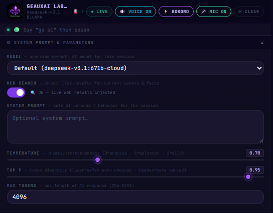
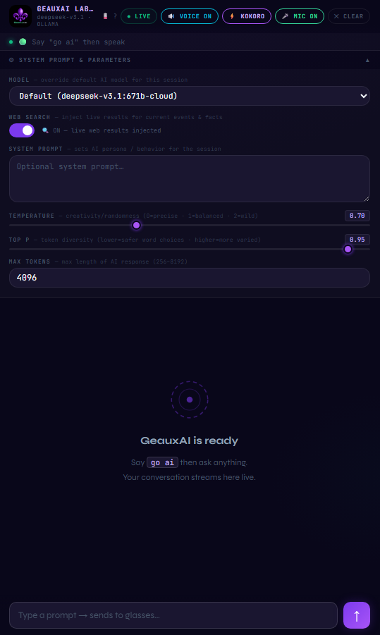
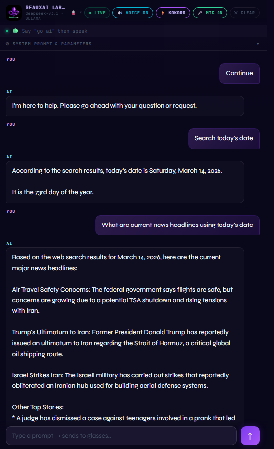

# ⬡ GeauxAiPrompt

**Voice AI assistant for the Even Realities G1 smart glasses, built on MentraOS.**

Talk to your glasses. See the AI response appear right in front of your eyes. A live chat log streams to your phone via a zero-JavaScript WebView — no app install required.

---

## Screenshots

### Working UI — Connected, Mic On, New Chat



> Header shows live connection status, mic toggle, and new chat reset. Conversation streams live from glasses to phone.

---

## Features

- **Always-on voice** — mic stays active, just speak into your G1 glasses
- **Live chat log** — conversation streams to your phone's WebView in real time
- **Multi-page AI responses** — long answers paginate automatically on the glasses display
- **🎤 MIC ON / 🔇 MIC OFF toggle** — mute/unmute the mic from your phone without stopping the app
- **✕ NEW CHAT** — clear conversation history instantly from your phone
- **Multi-provider AI** — works with Ollama (local/offline), OpenAI, or Anthropic
- **Zero JavaScript WebView** — uses `<meta http-equiv="refresh">` for live updates; works in any restricted WebView
- **Session expiry handling** — graceful "Session Expired" page instead of a crash loop after ~3 hours
- **Offline capable** — run fully local with Ollama, no cloud AI dependency

---

## Architecture

```
Even Realities G1 glasses
        │  (voice via MentraOS cloud)
        ▼
  MentraOS SDK (WebSocket)
        │
        ▼
  GeauxAiPrompt server (Bun + TypeScript + Express)
        │  ├── onTranscription → Ollama/OpenAI/Anthropic → showTextWall (glasses)
        │  └── /webview → meta-refresh HTML → phone browser
        ▼
  Phone WebView (live chat log)
```

**Key design decision:** The WebView uses zero JavaScript — no fetch, no EventSource, no WebSocket. A `<meta http-equiv="refresh" content="4">` tag reloads the page every 4 seconds with the latest conversation baked into the HTML server-side. This works in MentraOS's restricted WebView environment where JavaScript APIs may be blocked.

---

## Stack

| Component | Technology |
|-----------|-----------|
| Runtime | [Bun](https://bun.sh) |
| Language | TypeScript |
| Framework | Express (via MentraOS SDK) |
| Glasses SDK | [@mentra/sdk](https://docs.mentra.glass) |
| AI (default) | [Ollama](https://ollama.ai) — local inference |
| AI (optional) | OpenAI, Anthropic |

---

## Requirements

- [Bun](https://bun.sh) v1.0+
- A [MentraOS developer account](https://developers.mentra.glass) and API key
- Even Realities G1 smart glasses with the Mentra app installed
- [Ollama](https://ollama.ai) running locally (or OpenAI/Anthropic API key)
- [ngrok](https://ngrok.com) or similar tunnel to expose your local server

---

## Setup

### 1. Clone the repo

```bash
git clone https://github.com/YOUR_USERNAME/GeauxAiPrompt.git
cd GeauxAiPrompt
```

### 2. Install dependencies

```bash
bun install
```

### 3. Configure environment

```bash
cp .env.example .env
```

Edit `.env` — see the section below for what each variable means.

### 4. Pull your AI model (if using Ollama)

```bash
ollama pull llama3.2
```

### 5. Expose your server with ngrok

```bash
ngrok http 3000
```

Copy the `https://` URL — you'll need it when registering your app in the MentraOS developer portal.

### 6. Register your app on MentraOS

Go to [developers.mentra.glass](https://developers.mentra.glass), create an app, and set the webhook URL to your ngrok URL.

### 7. Run

```bash
bun run dev
```

Open the Mentra app on your phone, launch GeauxAiPrompt, and tap the WebView link to open the chat log.

---

## Environment Variables

Edit your `.env` file after copying from `.env.example`:

```env
# Required — your MentraOS developer API key
MENTRA_API_KEY=your_mentra_api_key_here

# Required — the email address you use to log into the Mentra app
OWNER_EMAIL=your@email.com

# Required — must match your app registration in the MentraOS developer portal
PACKAGE_NAME=com.yourname.yourappname

# AI provider: ollama | openai | anthropic
AI_PROVIDER=ollama

# Model to use (depends on provider)
AI_MODEL=llama3.2

# Ollama host (only for AI_PROVIDER=ollama)
OLLAMA_HOST=http://localhost:11434

# Only needed for their respective providers
OPENAI_API_KEY=
ANTHROPIC_API_KEY=
```

> **Important:** Never commit your `.env` file. It is already listed in `.gitignore`.

---

## How It Works

1. You speak into your G1 glasses
2. MentraOS transcribes the audio and sends it to your server via WebSocket
3. Your server calls the AI (Ollama by default)
4. The AI response is sent back to the glasses via `showTextWall()` — paginated if long
5. The response also appears in the phone WebView which auto-refreshes every 4 seconds
6. You can mute the mic or clear history from the phone WebView at any time

---

## Controls

| Button | Action |
|--------|--------|
| `🎤 MIC ON` | Tap to mute — glasses will no longer send transcriptions |
| `🔇 MIC OFF` | Tap to unmute — resumes voice input |
| `✕ NEW CHAT` | Clears all conversation history |

---

## Project Structure

```
GeauxAiPrompt/
├── src/
│   └── index.ts        # Main application — all server, session, and UI logic
├── .env.example        # Environment variable template
├── .env                # Your local config (never committed)
├── .gitignore
├── package.json
├── bunfig.toml
└── README.md
```

---

## Version

**v2.0.0-beta** — Stable voice + typed prompt pipeline. All core features working.

Built by [GeauxAI Labs]([/GeauxAI-Labs])

---

## License

MIT
