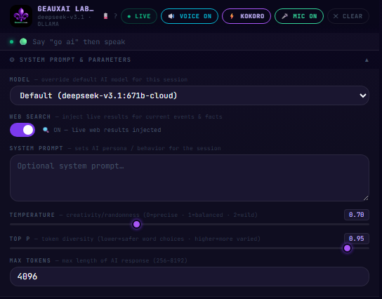
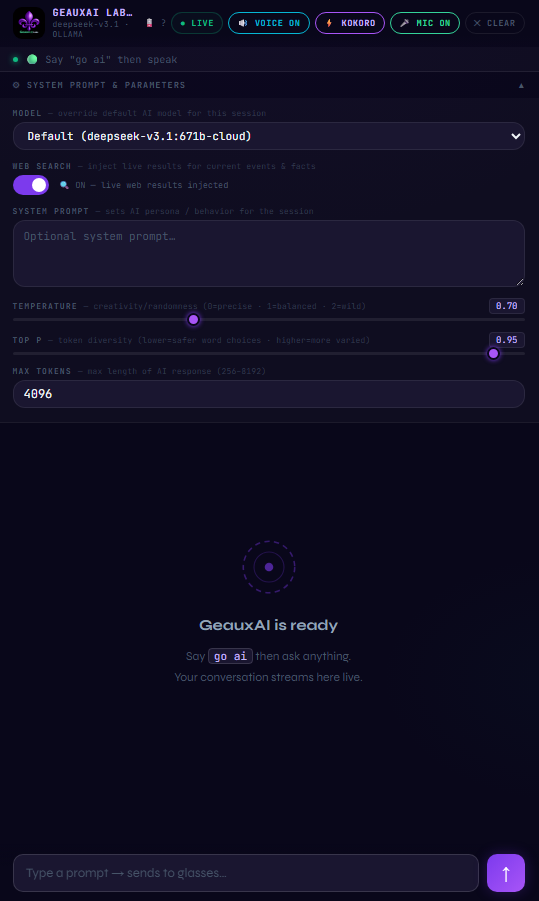
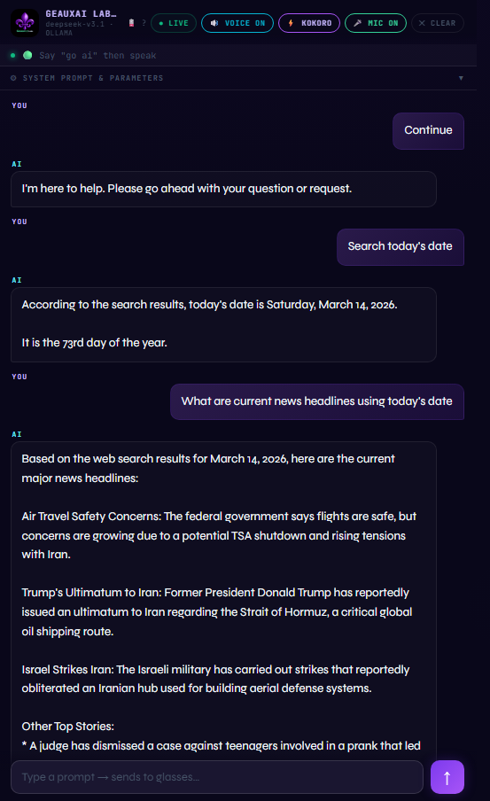

# ⬡ GeauxAiPrompt

**Voice AI assistant for the Even Realities G1 smart glasses, built on MentraOS.**

Talk to your glasses. See the AI response appear right in front of your eyes. A live chat log streams to your phone via SSE real-time push. Speak or type prompts — responses are read aloud via ElevenLabs or local Kokoro TTS.

---

## Screenshots

### Working UI — Connected, Voice On, Kokoro TTS Active



> Header shows live connection status, voice toggle, TTS engine selector, mic toggle, and new chat reset. Conversation streams live from glasses to phone via SSE.

---

## Features

- **Always-on voice** — mic stays active, just speak into your G1 glasses
- **Live chat log** — conversation streams to your phone via SSE real-time push (no page refresh)
- **Multi-page AI responses** — long answers paginate automatically on the glasses display
- **🔊 TTS audio readback** — AI responses read aloud via ElevenLabs (cloud) or Kokoro (local/free)
- **TTS engine toggle** — switch between ElevenLabs and Kokoro at runtime from the web UI
- **🎤 MIC ON / 🔇 MIC OFF toggle** — mute/unmute the mic from your phone
- **✕ NEW CHAT** — clear conversation history instantly
- **Multi-provider AI** — works with Ollama (local/offline), OpenAI, Anthropic, or any cloud model string
- **Tavily web search** — automatically searches the web for time-sensitive queries (news, sports, weather)
- **Auto-restart** — `start.sh` wrapper restarts the server on crash (max 10 restarts)
- **Multi-user support** — isolated session state per connected user
- **Offline capable** — run fully local with Ollama + Kokoro TTS, zero cloud dependency

---

## Architecture

```
Even Realities G1 glasses
        │  (voice via MentraOS cloud)
        ▼
  MentraOS SDK (WebSocket)
        │
        ▼
  GeauxAiPrompt server (Bun + TypeScript + Express)
        │  ├── onTranscription → AI → showTextWall (glasses)
        │  ├── speakWithElevenLabs → MentraOS audio proxy → glasses speaker
        │  ├── speakWithKokoro → Docker TTS → MP3 cache → SSE → browser audio
        │  └── /webview → SSE real-time push → phone browser
        ▼
  Phone WebView (live chat log + audio playback)
```

**TTS Architecture:**
- **ElevenLabs:** routes through `session.audio.speak()` → MentraOS cloud proxy → glasses speaker. Free — Mentra absorbs the cost.
- **Kokoro:** local Docker container on port 8880 → MP3 cached in memory → SSE `tts_audio` event → browser `<audio>` element. Fully free, unlimited, offline.

---

## Stack

| Component | Technology |
|-----------|-----------|
| Runtime | [Bun](https://bun.sh) |
| Language | TypeScript |
| Framework | Express (via MentraOS SDK) |
| Glasses SDK | [@mentra/sdk](https://docs.mentra.glass) |
| AI (default) | [Ollama](https://ollama.ai) — local inference |
| AI (optional) | OpenAI, Anthropic, any cloud model |
| Web search | [Tavily](https://tavily.com) |
| TTS (cloud) | [ElevenLabs](https://elevenlabs.io) via MentraOS proxy |
| TTS (local) | [Kokoro FastAPI](https://github.com/remsky/Kokoro-FastAPI) (Docker) |
| Tunnel | [ngrok](https://ngrok.com) |

---

## Requirements

- [Bun](https://bun.sh) v1.0+
- A [MentraOS developer account](https://developers.mentra.glass) and API key
- Even Realities G1 smart glasses with the Mentra app installed
- [Ollama](https://ollama.ai) running locally (or OpenAI/Anthropic API key)
- [ngrok](https://ngrok.com) or similar tunnel to expose your local server
- [Docker](https://docker.com) — for Kokoro local TTS (optional but recommended)

---

## Setup

### 1. Clone the repo

```bash
git clone https://github.com/GeauxAILabs/GeauxAiPrompt.git
cd GeauxAiPrompt
```

### 2. Install dependencies

```bash
bun install
```

> ⚠️ **WSL users:** Run `sudo apt install -y unzip` before the Bun installer or it silently fails.

### 3. Configure environment

```bash
cp .env.example .env
```

Edit `.env` — see the section below for all variables.

### 4. Pull your AI model (if using Ollama)

```bash
ollama pull llama3.2:3b
```

### 5. Start Kokoro TTS (optional, for local voice)

```bash
docker run -d --name kokoro-tts --restart unless-stopped \
  -p 8880:8880 ghcr.io/remsky/kokoro-fastapi-cpu:latest
```

### 6. Expose your server with ngrok

```bash
ngrok http 3000
```

Copy the `https://` URL — you'll need it in the MentraOS developer portal.

### 7. Register your app on MentraOS

Go to [developers.mentra.glass](https://developers.mentra.glass), create an app, set the webhook URL to your ngrok URL.

### 8. Run

```bash
./start.sh
```

> ⚠️ **Windows/WSL:** If `start.sh` errors on first run, fix line endings: `sed -i 's/\r//' start.sh && chmod +x start.sh`

Open the Mentra app on your phone, launch GeauxAiPrompt, and open `http://localhost:3000` in your browser for the web UI.

---

## Environment Variables

```env
# MentraOS
MENTRA_API_KEY=your_mentra_api_key
OWNER_EMAIL=your@email.com
PACKAGE_NAME=com.geauxailabs.geauxaiprompt

# AI — Ollama (default)
AI_PROVIDER=ollama
AI_MODEL=deepseek-v3.1:671b-cloud
OLLAMA_HOST=http://localhost:11434

# AI — Cloud providers (optional)
OPENAI_API_KEY=
ANTHROPIC_API_KEY=

# Web search
TAVILY_API_KEY=your_tavily_key

# TTS — ElevenLabs (via MentraOS proxy, free)
ELEVENLABS_API_KEY=your_key
ELEVENLABS_VOICE_ID=JBFqnCBsd6RMkjVDRZzb

# TTS — Kokoro (local Docker, free)
KOKORO_HOST=http://localhost:8880
KOKORO_VOICE=am_eric

# Timing
AUTO_CLEAR_DELAY_MS=60000

# Public URL (for reference only)
PUBLIC_BASE_URL=https://app.geauxailabs.com
```

> **Never commit your `.env` file.** It is in `.gitignore`.

---

## Kokoro Voice Options

67 voices available. Change `KOKORO_VOICE` in `.env` and restart.

| Voice | Style |
|---|---|
| `am_eric` | American male |
| `am_adam` | American male, deeper |
| `af_bella` | American female, warm |
| `af_nova` | American female, smooth |
| `bm_george` | British male |
| `bf_emma` | British female |

Full list: `curl http://localhost:8880/v1/audio/voices`

---

## Controls

| Control | Action |
|--------|--------|
| `⚡ KOKORO` / `☁ ELEVEN` chip | Switch TTS engine at runtime |
| `🔊 VOICE ON` chip | Toggle TTS audio on/off |
| `🎤 MIC ON` chip | Toggle mic mute |
| `✕ CLEAR` | Clear conversation history |
| G1 button press | Re-show last response on glasses |
| G1 long press | Clear history |

---

## Project Structure

```
GeauxAiPrompt/
├── src/
│   └── index.ts          # All server, session, UI, and TTS logic
├── docs/                 # Screenshots
├── start.sh              # Auto-restart production launcher
├── start-dev.sh          # Hot-reload dev launcher
├── .env.example          # Environment variable template
├── .env                  # Your local config (never committed)
├── .gitignore
├── package.json
├── bunfig.toml
├── CHANGELOG.md
└── README.md
```

---

## Version

**v3.0.0** — Full TTS audio readback (ElevenLabs + Kokoro), SSE real-time push, Tavily web search, glassmorphic UI, multi-user support, auto-restart.

Built by [GeauxAI Labs](https://github.com/GeauxAILabs)

---

## License

MIT
